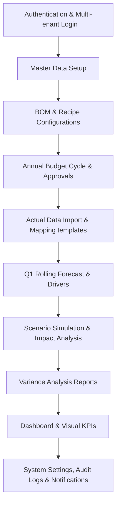

# User Acceptance Testing (UAT) Plan
**Project Name**: idiibi FP&A Suite SaaS Platform  
**Target Organization**: iDiibi Manufacturing Co.  
**Version**: 1.0  
**Date**: June 11, 2026  
**Author**: Antigravity Quality Engineering  

---

## 1. Introduction

### 1.1 Document Purpose
This document defines the User Acceptance Testing (UAT) Plan for the **idiibi FP&A Suite**, a modern multi-tenant SaaS platform built for Financial Planning & Analysis (FP&A) with a particular focus on food manufacturing, food retail, and branch networks. 

The primary objective of this UAT is to verify that the built web application and backend match the operational and financial requirements specified in the PDF requirements documentation and technical architecture.

### 1.2 Target System Description
The system under test is the **idiibi FP&A Suite** (running on Next.js/NestJS/MariaDB), configured for the tenant **`idiibi-demo`** (Tenant ID 2) and the company **`iDiibi Manufacturing Co.`**. The suite integrates operational drivers (production capacity, Bill of Materials, product SKUs, and sites) with financial plans (Budgets, rolling Forecasts, actual data imports, and Variance reports).

---

## 2. Test Environment & Credentials

The test environment has been initialized with comprehensive mock data representing a food manufacturing facility (Apple Juice and Full Cream Milk production).

* **Tenant ID / Slug**: `2` / `idiibi-demo`
* **Email**: `admin@idiibi.com`
* **Password**: `Admin@123456`
* **Company**: `iDiibi Manufacturing Co.`
* **Environment URLs**:
  * Frontend Application: `http://localhost:3000`
  * Backend API: `http://localhost:3001/api`
  * Swagger Documentation: `http://localhost:3001/api/docs`

---

## 3. Scope of Testing

The UAT scope spans the following system components and workflows:

### 3.1 In-Scope Functional Areas
1. **Multi-Tenant Authentication**: Sign-in with tenant isolation and roles.
2. **Master Data Management**: CRUD for Sites (Factories, Warehouses, Offices), Units of Measure, Accounts, Cost Centers, Product Categories, Products, Suppliers, and Customers.
3. **BOM & Manufacturing Costing**: Recipe versions, raw material ingredients, labor/overhead inputs, and wastage percentages.
4. **Budgeting Cycle**: Annual budgeting, monthly allocations, approvals workflow.
5. **Actual Import Engine**: Mapping spreadsheet columns (CSV/Excel) to logical fields, data validation, error logging, and post verification.
6. **Rolling Forecast**: Generating rolling forecasts, driver-based logic (`sales_growth`, `rolling_avg`, `manual`), and scenario links.
7. **Scenario Planning & Simulations**: Custom scenarios (e.g. material price spikes, demand drop) and previews of P&L impact.
8. **Variance Analysis**: Comparisons between Budget vs. Actual, Budget vs. Forecast, Actual vs. Forecast, and Budget vs. Actual vs. Forecast.
9. **Financial & Operational Reporting**: Profitability analysis by product, branch, and customer; gross margins, factory costing, net profits, and wastage.
10. **Dashboard KPIs**: Interactive trend lines, bar charts, and indicators.
11. **Integrations Manager**: Connections setup (Oracle, POS, ERP) and manual sync execution.
12. **Audit Trails & Notifications**: Action history diffing and threshold breach alerts.

---

## 4. Test Roles and Responsibilities

User acceptance testing will be carried out representing the key organizational roles configured within the system:

| Role | Responsibility in UAT | Key Focus Areas |
|------|-----------------------|-----------------|
| **Super Admin** | Platform maintenance and initial environment validation | Company setup, integration connections, user/role management |
| **CFO** | High-level review and workflow approvals | Approving Budget/Forecast cycles, reviewing cash flow, gross margins, and P&L reports |
| **FP&A Manager** | Model generation, scenario running, and variance audits | Budget & Forecast cycle creation, scenario modeling, variance analysis |
| **Financial Analyst** | Operational data entry and file imports | Performing Actual Imports, mapping columns, creating products and BOM recipes |
| **Viewer / Auditor** | Read-only observation and validation | Accessing dashboards, viewing reports, auditing logs |

---

## 5. UAT Methodology & Execution

1. **Prerequisites Verification**: Ensure the Next.js frontend and NestJS backend are booted and connected to the MariaDB database.
2. **Step-by-Step Execution**: Follow the detailed scenarios in `test_cases.md`.
3. **Result Logging**: Record Pass/Fail status, response codes, and observations.
4. **Data Verification**: Confirm that transactions posted during imports successfully populate the reporting views (`vw_budget_vs_actual`, etc.).
5. **Issue Reporting**: Log any variance from expected behavior in the issue tracker.

---

## 6. Entry and Exit Criteria

### 6.1 Entry Criteria
- The codebase passes full TypeScript verification and builds without errors.
- Database seed script has run successfully on the MariaDB instance.
- Test files (`oracle_actuals_sample.csv`, `pos_sales_sample.csv`, `erp_expenses_sample.csv`, `budget_template_sample.xlsx`, `forecast_template_sample.xlsx`) are available for import testing.

### 6.2 Exit Criteria
- **100%** of critical path test cases executed.
- **95%** minimum pass rate across all functional test cases.
- Zero critical or high-severity bugs open (such as 400 Bad Request on page load, or database constraints blocking uploads).
- CFO approves the Budget and Forecast workflow cycles.
